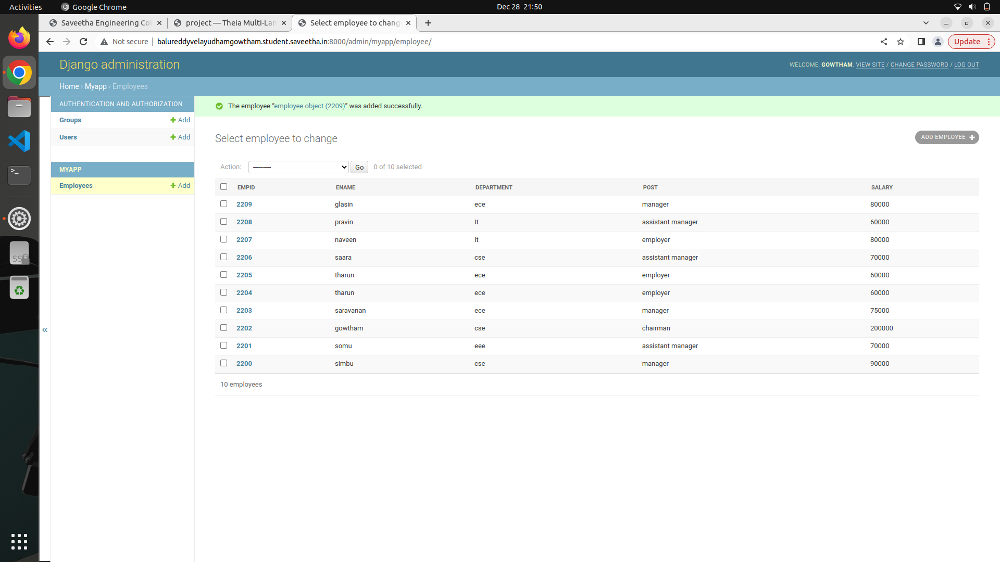
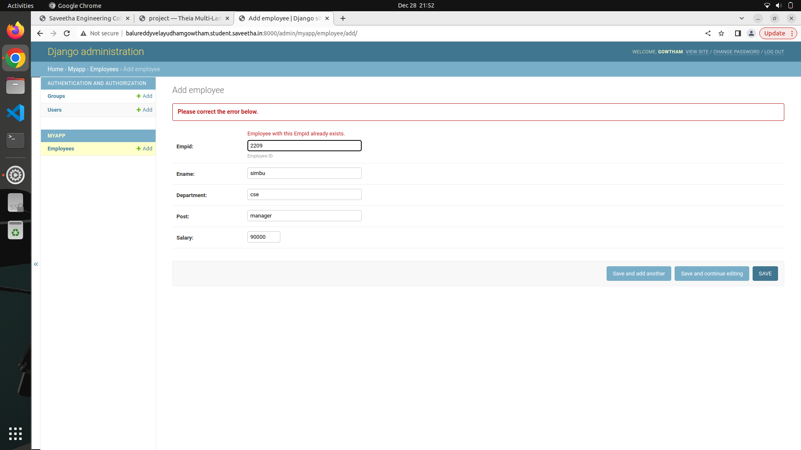

# Django ORM Web Application

## AIM
To develop a Django application to store and retrieve data from a database using Object Relational Mapping(ORM).

## Entity Relationship Diagram


## DESIGN STEPS

### STEP 1:
1.open student.ac.in website.
### STEP 2:
2.Go to your theaid account.

### STEP 3:

3.Enter the various categories in models.py and admin.py.

4.Save the changes.

5.Run the server using suitable commands like git cloning,runserver etc.

6.Then go to the website create a minimum of 10 employee id.

## PROGRAM

from django.db import models
from django.contrib import admin
# Create your models here.
```python
MODELS.PY
class emoplyee(models.Model):
    empid=models.CharField(primary_key=True, max_length=4,help_text='Employee ID')
    ename=models.CharField(max_length=50)
    department=models.CharField(max_length=30)
    post=models.CharField(max_length=20)
    salary=models.IntegerField()   

class StudentAdmin(admin.ModelAdmin):
    list_display=('empid','ename','department','post','salary')
```
ADMIN.PY
```python
from django.contrib import admin
from .models import Employee,EmployeeAdmin  
# Register your models here.
admin.site.register(Employee,EmployeeAdmin)

```
## OUTPUT

Include the screenshot of your admin page.




## RESULT
