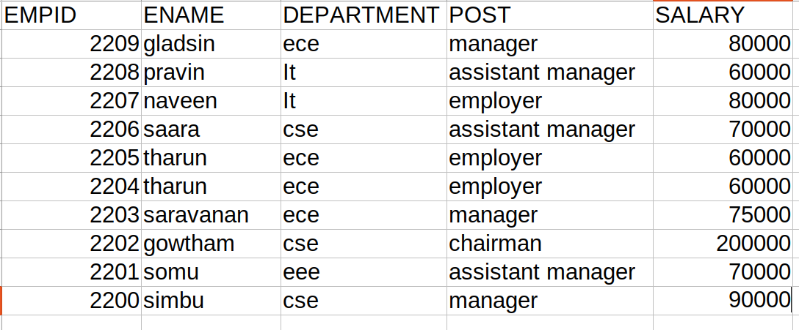

# Django ORM Web Application

## AIM
To develop a Django application to store and retrieve data from a database using Object Relational Mapping(ORM).

## Entity Relationship Diagram



## DESIGN STEPS

### STEP 1:
1.open student.ac.in website.
### STEP 2:
2.Go to your theaid account.

3.Use the command git startapp<filename>myapp

### STEP 3:

3.Enter the various categories in models.py and admin.py.

4.Save the changes.

5.Run the server using suitable commands like git cloning,runserver etc.

6.Then go to the website create a minimum of 10 employee id.

7.after finishing the project in theaid,then we have to push the details in theaid to github using commands like git origin main,git push etc.

8.we would get the output in the git hub account.


## PROGRAM
```python
MODELS.PY
class emoplyee(models.Model):
    empid=models.CharField(primary_key=True, max_length=4,help_text='Employee ID')
    ename=models.CharField(max_length=50)
    department=models.CharField(max_length=30)
    post=models.CharField(max_length=20)
    salary=models.IntegerField()   

class StudentAdmin(admin.ModelAdmin):
    list_display=('empid','ename','department','post','salary')
```
ADMIN.PY
```python
from django.contrib import admin
from .models import Employee,EmployeeAdmin  
# Register your models here.
admin.site.register(Employee,EmployeeAdmin)

```

# Create your models here.

## OUTPUT

Include the screenshot of your admin page.


    
  verifying primary key


## RESULT
   
    Finally,we developed a Django application to store and retrieved data from a database using Object Relational Mapping(ORM).
  
